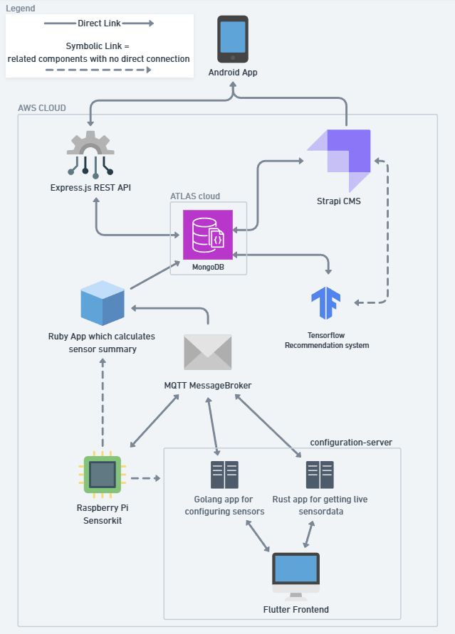

# Readscape

A community personal library application where you can lend and borrow books from your friends, as well as keep your personal library. You can publish your books to a booklisting where it will become public to all users, or you can keep your collection private for your own personal use. By integrating a sensorkit in the room where you keep books, you can get a notification when the room conditions become bad for the longevity of the books. 

# Project Checklist

## CMS

- [X] Use a headless CMS system to store all the cloud data.

We have used a Strapi headless cms ([ReadScapeStrapi](https://gitlab.ti.howest.be/ti/2023-2024/s5/ccett/projects/group11/code/readscapestrapi)) for storing the booklistings, which is basically the public books visible to all users, as mentioned above. All the data concering the booklisting, which is the book data itself, is stored on the cloud via the CMS. Other data which is not directly related to the public booklistings, are **not** stored via the CMS.
- [x] Make all endpoints through the CMS system (CRUD).

All the endpoints related to the public booklisting, from viewing them, to editing them, to deleting them, are done through the CMS system.
- [x] Visualize the data stored in the CMS system by creating/using the 'head' of the CMS.

The android app visualises all the cms content.
- [x] Create an application using TensorFlow that consumes the data stored in the CMS.

There is a python juypiter notebook which uses tensorflow ([ReadScapeTensorFlowRecommender](https://gitlab.ti.howest.be/ti/2023-2024/s5/ccett/projects/group11/code/readscapetensorflowrecommender)), which runs every minute, and fills the similarbooks section of each booklisting. This model is trained on the relation of the similarbook sections of the existing books and the property of the books (autors, categories, title, ..). Thus when we adjust a similarbooks section manually, the tensorflow application will take our decision into account when it tries to create a similarbooks section for the next booklisting based on the properties of the book.

## Cloud & Edge Computing

- [X] Use at least 2 devices.

The Android device, and the sensorkit for measuring room conditions.
- [X] Make use of WiFi communications.

Each device uses WIfI communications to connect to apis and messagebroker.
- [X] Have minimum two different sensors for each device.

For the Android device we have a camera for scanning barcode ISBN when adding a book as well as NFC handshake for lending and borrowing books from another user on the same app as a physical proof that books have exchanged. And for the sensorkit we have a temperature and a light sensor.
- [X] Have minimum one type of data that is continuously sampled and monitored on the cloud platform.

The temperature and light sensor data is continuously sampled and monitored on the cloud platform.
- [X] Implement at least one use case of Edge Computing –> device to device actions.

NFC handshake between the 2 android devices for lending and borrowing books.
- [X] Use at least 1 other protocol besides HTTP to send data to the message broker.

MQTT is the protocol for the messagebroker, which the configuration server, live sensor server, ruby app and the raspberri pi itself uses.
- [X] Ensure quality/performance/privacy/security of the application.

We did our best.
- [X] Define minimum one event based on sensor data that triggers a notification for the user.

When temperature and light from the sensorkit reach a certain treshold, a notification is sent to the user.
- [X] Define minimum one event triggered by the user that causes a device to take action.

When the user uses the configuration client, they can change configuration on how often the sensorkit should send data to the cloud, and also turn it on and off.
- [X] Define minimum one event triggered by the cloud platform that causes the device to take action.

The cloud determines whether room condition is dangerous or not, and based on that, the user will get a notification.
- [X] Perform some computations in the cloud, as the cloud platform is more than a database.

Everything is deployed, except for the Android application and the sensorkit itself.

## Trending Topics

- [X] Create 1 application for each team member with an own use case in the project.
- [X] Use a different unknown programming language or concept for each application.

- Rust for a server to get live sensordata
- Golang for a server to configure the sensorkit
- Flutter dart as frontend for the above 2 servers
- Golang getting the sensordata, labeling it and putting it on the database

1. [BrokerMongoPipeline]()
2. [ConfigurationClient]()
3. [ConfigurationServer]()
4. [LiveSensorDataServer]()
5. [ReadScapeAPI]()
6. [ReadScapeApp]()
7. [ReadScapeStrapi]()
8. [ReadScapeTensorFlowRecommender]()
9. [SensorKit]()

